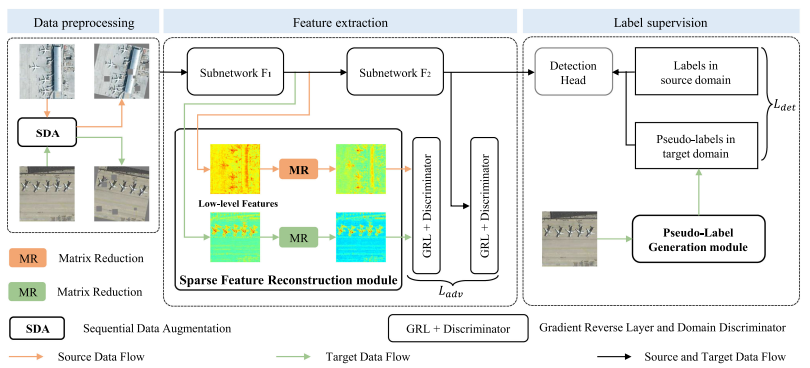

# [RFA-Net: Reconstructed Feature Alignment Network for Domain Adaptation Object Detection in Remote Sensing Imagery](https://doi.org/10.1109/JSTARS.2022.3190699) (JSTARS 2022)

This is the PyTorch implementation of our paper: 

**RFA-Net: Reconstructed Feature Alignment Network for Domain Adaptation Object Detection in Remote Sensing Imagery**

IEEE Journal of Selected Topics in Applied Earth Observations and Remote Sensing 2022

[Yangguang Zhu](https://github.com/ygzhu); Xian Sun; Wenhui Diao; Hao Li; Kun Fu





# What we are doing and going to do

- [ ] Add the strong data augmentation for the training process


# Installation

## Prerequisites


Please refer to the requirement.txt

## Build
```
cd lib
python setup.py develop build 
```
Please refer to [SWDA](https://github.com/VisionLearningGroup/DA_Detection)
(Different from the SWDA, we have update the code to adapt PyTorch==1.0.0. The PyTorch version of SWDA is 0.4.0. You can also use the higher version of PyTorch, but some scripts may be revised. )

# Data Data Preparation
Please refer to [SWDA](https://github.com/VisionLearningGroup/DA_Detection)

## NWPU VHR-10 Dataset
Download the dataset from [Link](https://gcheng-nwpu.github.io/)

## DIOR Dataset
Download the dataset from [Link](https://gcheng-nwpu.github.io/)
Extract the same ten classes as NWPU VHR-10 Dataset to generate DIOR*

## HRRSD
Download the dataset from [Link](https://github.com/CrazyStoneonRoad/TGRS-HRRSD-Dataset)
Extract the same ten classes as NWPU VHR-10 Dataset to generate DIOR*

# Training

## Conduct  Pseudo-Label Generation
- Please refer to [Link](https://github.com/jwyang/faster-rcnn.pytorch/tree/pytorch-1.0)

- Generate the pseudo labels for DIOR* and HRRSD*

- Formulate the DIOR_ten_class_pseudo_label and hrrsd_pseudo_label.

- Don`t forget to register these datasets in the code.

## Train the Model

**Demo**


- Train the RFA-Net with vgg16 under NWPU VHR-10 Dataset (source) and DIOR* (target)

```shell
python trainval_net_RFA_Net.py --use_tfb --datase nwpu_vhr --dataset_t DIOR_ten_class_pseudo_label --net vgg16 --cuda --save_dir YOUR_PATH_TO_SAVE_THE_MODEL

```


- Train the RFA-Net with res101 under NWPU VHR-10 Dataset (source) and HRRSD* (target)

```shell
python trainval_net_RFA_Net.py --use_tfb --datasenwpu_vhr --dataset_t DIOR_ten_class --net res101 --cuda --save_dir YOUR_PATH_TO_SAVE_THE_MODEL
```

## Test the Model

- Test the RFA-Net with res101 under NWPU VHR-10 Dataset (source) and HRRSD* (target)

```
python test_net_RFA_Net.py --dataset DIOR_ten_class --net res101 --cuda --load_name YOUR_CHECKPOINT_PATH
```

